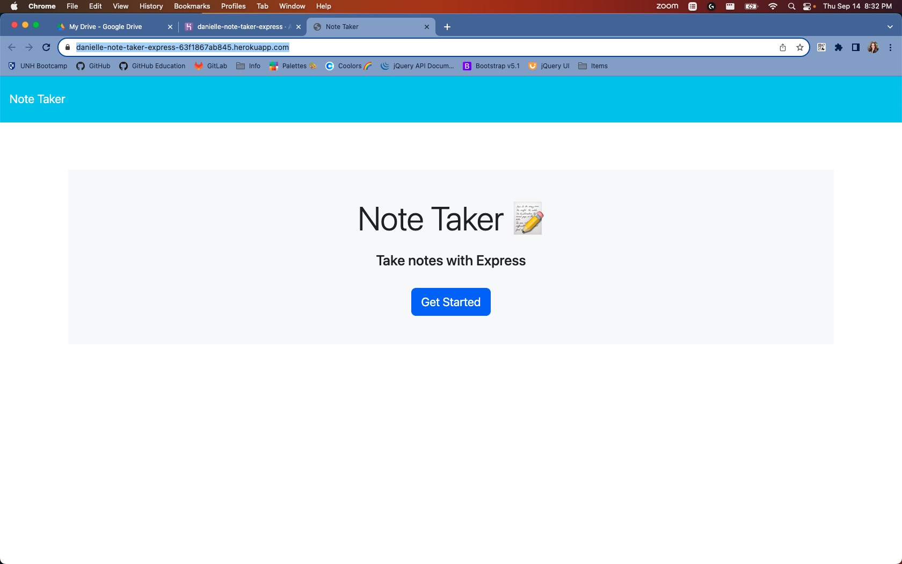
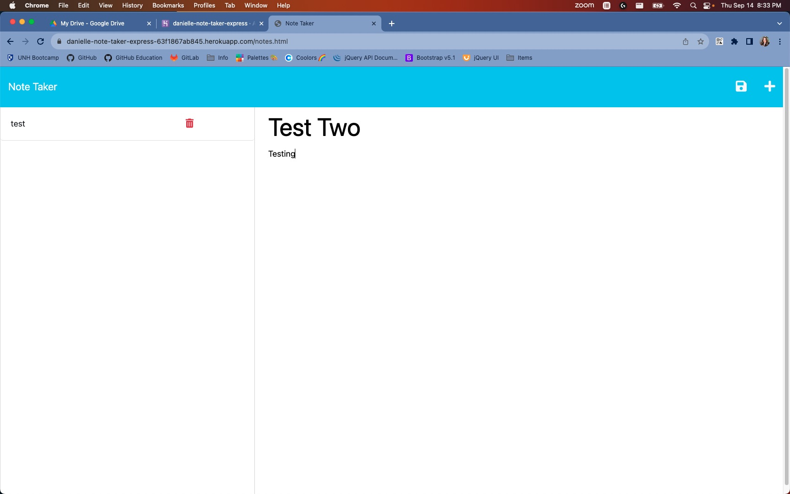
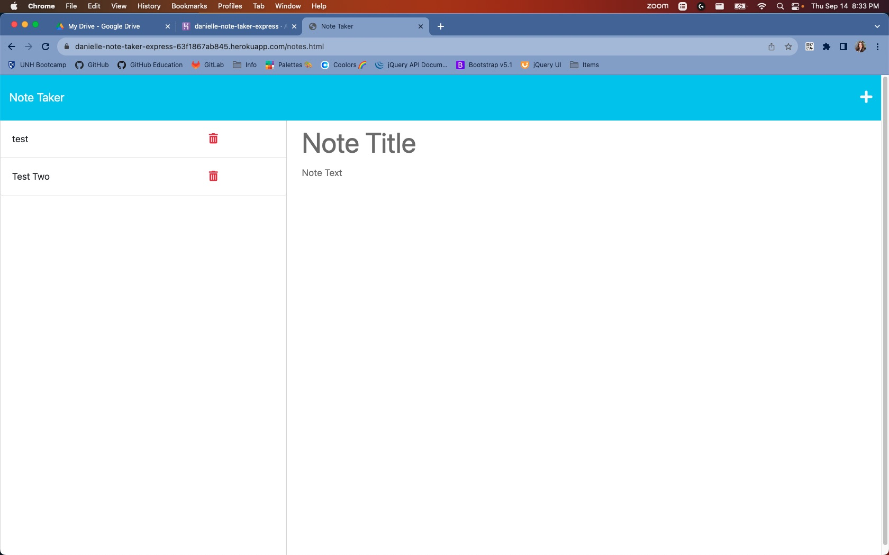

# Danielle-Note-Taker-Express

## Description
This application was created using JavaScript, Node, Express, HTML, Insomnia, and then Heroku was used for deployment. It's intended use is to create notes and save them for later, and once you are done with that note, you can delete it. You may add as many notes as you like. Life gets busy and hopefully this application can help you keep track of your daily tasks!

## Installation
No installation necessary, just go to the link below on Chrome, Edge, Safari, Firefox, etc.

## Usage
Below is a quick video of how the application fuctions, as well as some pictures. As mentioned above, use this note taker to keep track of tasks or even a grocery list!

[Link to note taking site](https://danielle-note-taker-express-63f1867ab845.herokuapp.com/)

[Where to watch a video example](https://drive.google.com/file/d/1D5lWTgMD69V3AdeB1jGPmaogkz7OESKF/view?usp=drive_link)

## License
MIT License

Copyright (c) [2023] [Danielle-Note-Taker-Express]

Permission is hereby granted, free of charge, to any person obtaining a copy
of this software and associated documentation files (the "Software"), to deal
in the Software without restriction, including without limitation the rights
to use, copy, modify, merge, publish, distribute, sublicense, and/or sell
copies of the Software, and to permit persons to whom the Software is
furnished to do so, subject to the following conditions:

The above copyright notice and this permission notice shall be included in all
copies or substantial portions of the Software.

THE SOFTWARE IS PROVIDED "AS IS", WITHOUT WARRANTY OF ANY KIND, EXPRESS OR
IMPLIED, INCLUDING BUT NOT LIMITED TO THE WARRANTIES OF MERCHANTABILITY,
FITNESS FOR A PARTICULAR PURPOSE AND NONINFRINGEMENT. IN NO EVENT SHALL THE
AUTHORS OR COPYRIGHT HOLDERS BE LIABLE FOR ANY CLAIM, DAMAGES OR OTHER
LIABILITY, WHETHER IN AN ACTION OF CONTRACT, TORT OR OTHERWISE, ARISING FROM,
OUT OF OR IN CONNECTION WITH THE SOFTWARE OR THE USE OR OTHER DEALINGS IN THE
SOFTWARE.
